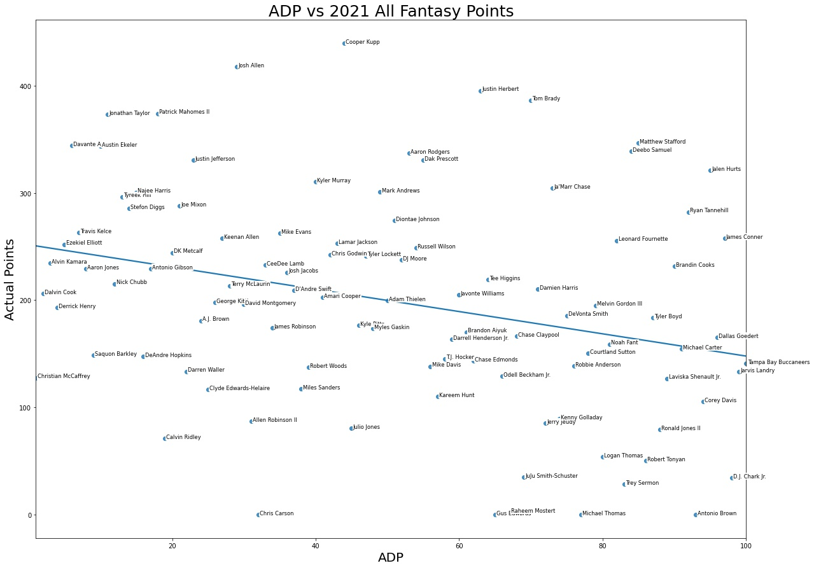
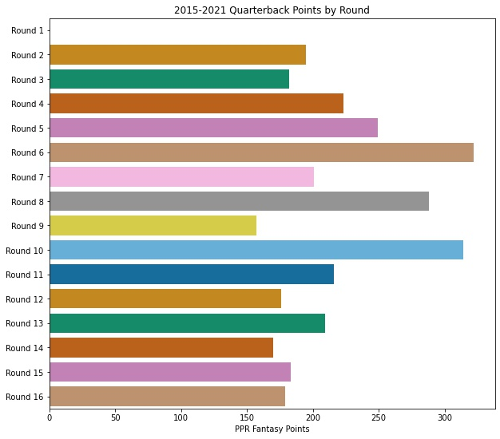
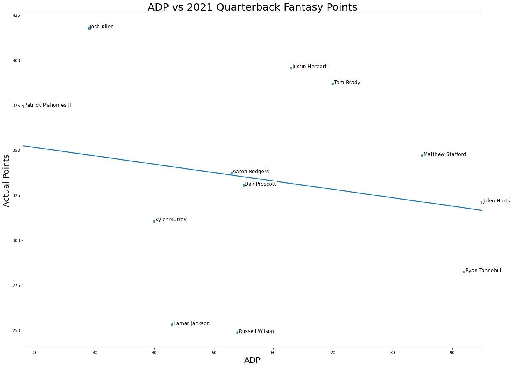
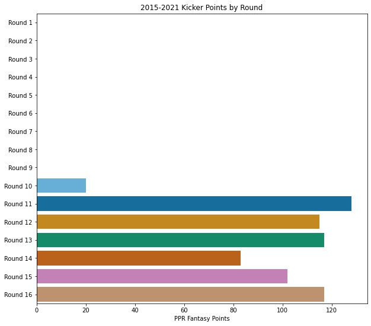
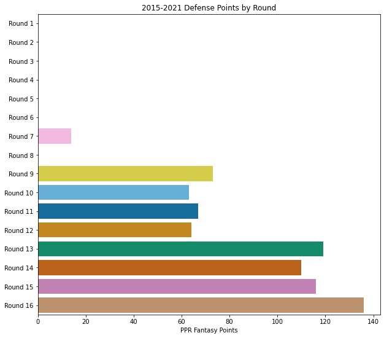
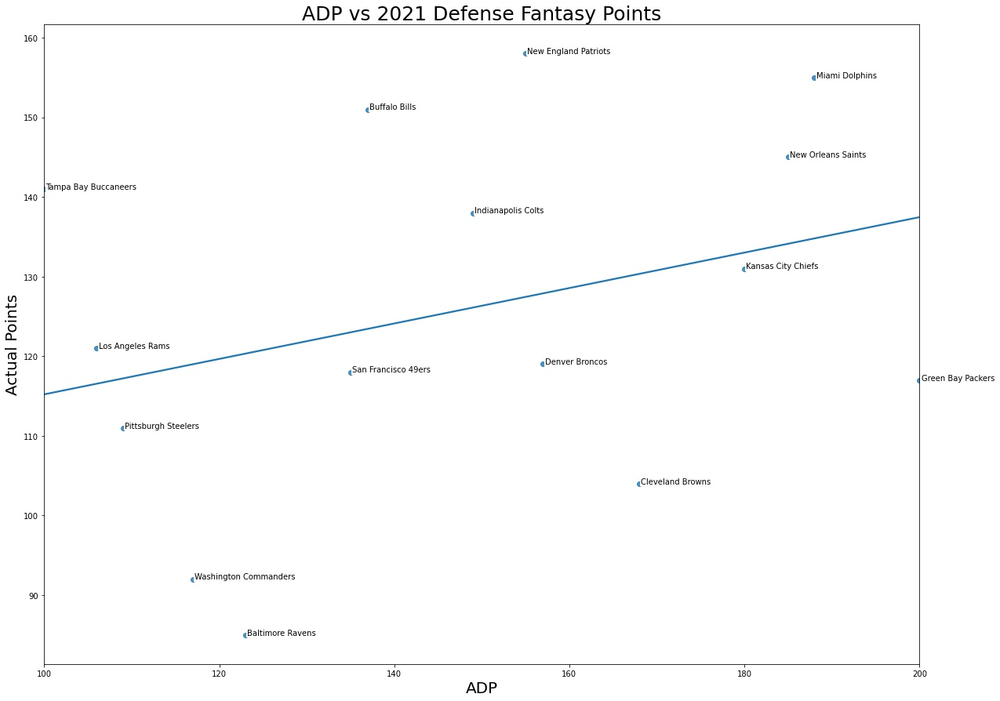
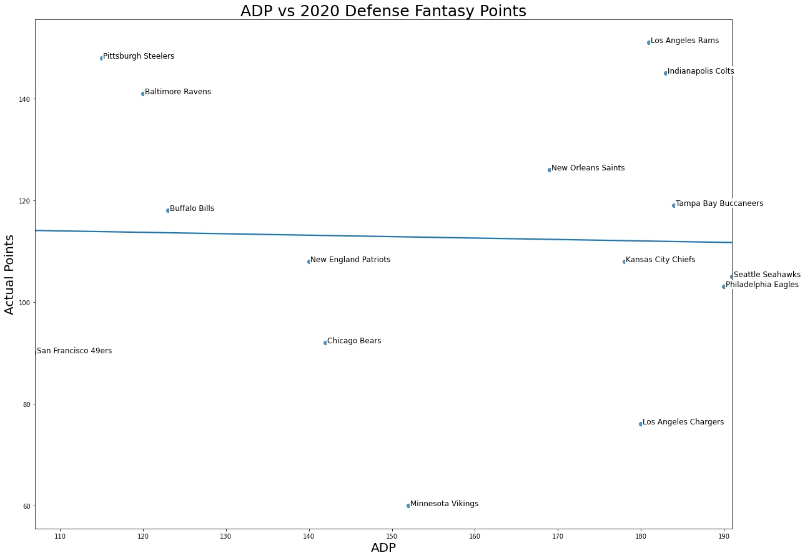
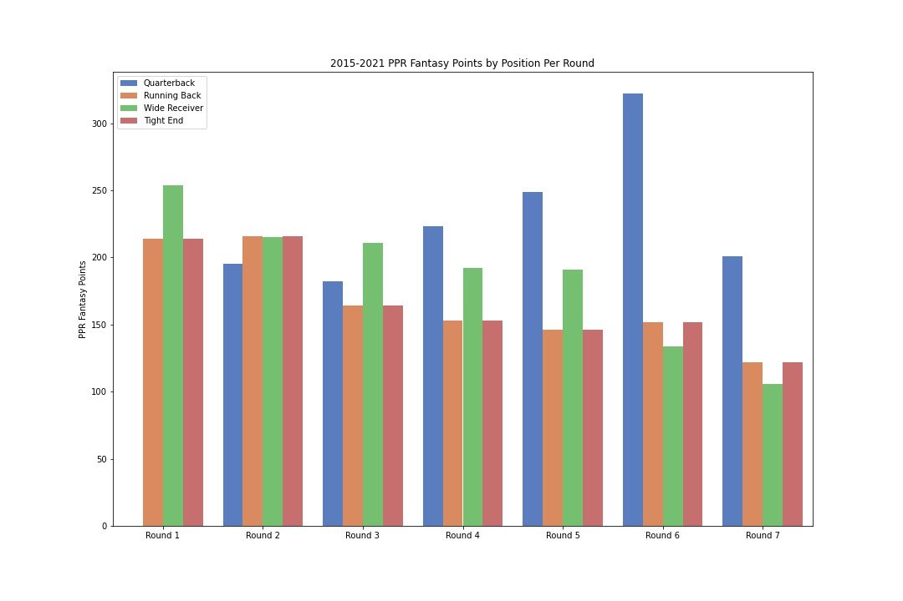
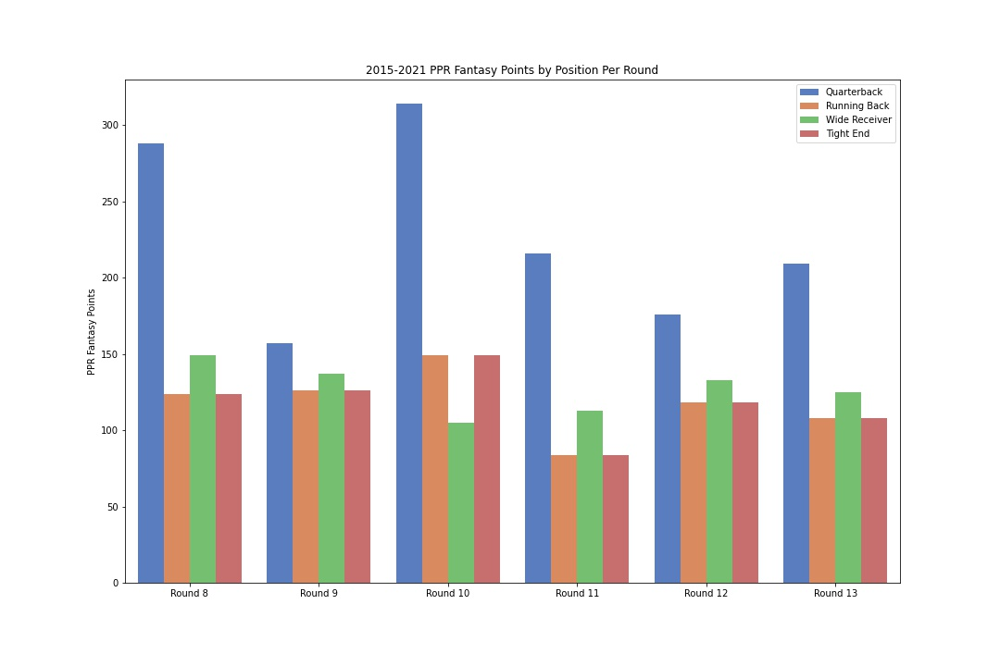
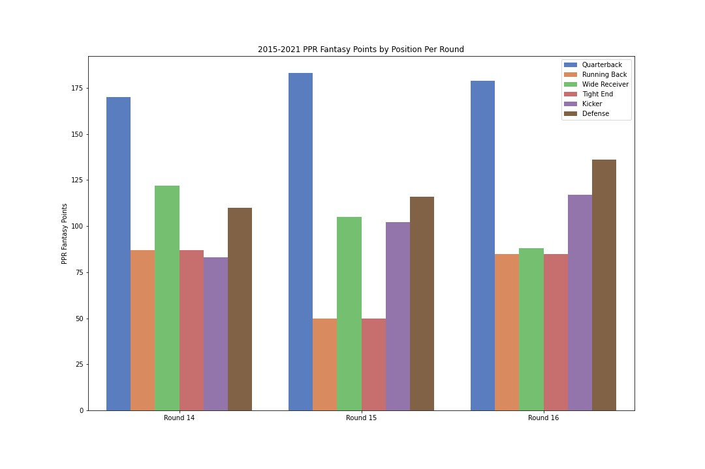

# Draft Analysis for the 2022 Fantasy Football Season

**Author**: Melody Bass

 <br />

## Overview

Fantasy football is a game in which football fans take on the role of a manager of a pro football team. A fantasy football league, typically consisting of 10-14 competitors, holds a draft before the NFL season where each fantasy competitor has a limited number of resources (salary cap or number of draft picks) to assemble their team. Each competitor selects their virtual team comprised of real NFL athletes in various set positions. Fantasy competitors then face one another in head to head competitions every week of the regular NFL season, while the scoring is dictated by the statistical in-game performance of the actual NFL player during that week. There are several variations to league scoring, most notably standard or PPR (Point per Reception) scoring. PPR scoring will be the focus of this project where players receive an additional point for every reception in the game.

The aim of this project is to provide a detailed analysis of historical fantasy football drafts and generate an ARIMAX time series model to predict veteran player (more than 3 seasons) points for the 2022 NFL season. Utilizing historical Average Draft Position (ADP) and total fantasy points during the season, we are able to draw several conclusions about draft strategy and where the most value is the respective round of the draft.

An ARIMAX time series model was built utilizing weekly player PPR fantasy points from the 2017 - 2021 NFL seasons and player snaps as an exogenous variable. The model forecasts quarterback, running back, wide receiver, and tight end fantasy points for the 2022 NFL season. The projected points were plotted vs the player's ADP to identify steals and busts in the 2022 fantasy draft.

## Business Problem

Nathan Hall will be competing in high stakes fantasy football leagues to earn money.  He will be using the results of the model predictions to draft his 2022 fantasy teams.

The results of this project are geared towards the settings of Nathan's league.  The league in which he will be competing consists of 12 teams, PPR scoring, and has a randomly set snaking draft order. The positions he will be drafting are as follows:

* 1 Quarterback
* 2 Running Backs
* 2 Wide Receivers
* 1 Tight End
* 1 Flex spot (TE/WR/RB)
* 1 Kicker
* 1 Defense
* 6 Bench spots


## Data Understanding

There are 3 sets of compiled datasets that are used for this analysis:
1. Weekly PPR fantasy points from NFL seasons 2017 - 2021 for veteran players (over 3 seasons) in the top 200 2022 ADP
2. Weekly snap counts from NFL seasons 2017 - 2021 for veteran players (over 3 seasons) in the top 200 2022 ADP
3. Yearly PPR fantasy points from NFL seasons 2015 - 2021 for players in the top 200 ADP for the respective year

All datasets were downloaded from the Fantasy Pros website and the first two can be found [here](https://www.fantasypros.com/nfl/stats/qb.php) (points) and [here](https://www.fantasypros.com/nfl/reports/snap-counts/) (snap counts). Individual .csv files for every game week from 2017-2021 were downloaded selecting the option for PPR scoring and Consensus Roster %. The aggregate yearly dataset for the 2015 - 2021 seasons were also obtained in this fashion while selecting the option for the full season.  The 2022 ADP dataset was downloaded [here](https://www.fantasypros.com/nfl/adp/overall.php) with PPR scoring selected. The 2015 - 2021 ADP datasets can be found [here](https://www.fantasypros.com/nfl/adp/ppr-wr.php?year=2020) with PPR scoring selected.

The data cleaning and preparation for the weekly fantasy points and snap counts datasets can be found in this repository titled [Weekly Player Data ETL.ipynb](https://github.com/meljoy1099/fantasy-football-draft-analysis/blob/main/Weekly%20Player%20Data%20ETL.ipynb). The data cleaning for the yearly fantasy points dataset can be found under [Yearly Player Data ETL.ipynb](https://github.com/meljoy1099/fantasy-football-draft-analysis/blob/main/Yearly%20Player%20Data%20ETL.ipynb).

The first datasets are separated by position: 
* Quarterback (qb)
* Running back (rb)
* Wide receiver (wr)
* Tight end (te)

They contain weekly PPR fantasy points from NFL seasons 2017 - 2021 as the rows and columns for each player. This will be used as our endogenous time series data for ARIMAX modeling.

The second datasets on the list are separated by position (qb, rb, wr, te) and contain weekly snap counts from NFL seasons 2017 - 2021 as the rows and columns for each player. The data will be used as the exogenous time series data for ARIMAX modeling.

The third datasets on the list are separated by year (2015, 2016, 2017, 2018, 2019, 2020, 2021) and contain yearly fantasy points for quarterbacks, running backs, wide receivers, tight ends, kickers, and defenses. This data will be used for historical fantasy analysis and recommendations in EDA section of notebook.

## Historical Draft EDA

 <br />

### Quarterbacks

Quarterbacks score the most points as a group, so we would see several quarterbacks that are far above their projected ADP like we do in the above 2021 ADP vs Actual points plot. There was a time when quarterbacks would go in the first round in fantasy drafts for this reason, but the industry has wised up since then to have our top quarterbacks going in the 2nd, 3rd, and 4th rounds. There is not a large spread across this position and first picks should focus on other positions with a higher spread. 

 <br />

Quarterbacks historically have the highest average value in the 6th and 10th round of the draft. In 2021, these key 6th round picks would have been Justin Herbert and Tom Brady.

 <br />

### Running Backs

 <br />

Running backs have a high value in the 1st and 2nd rounds with a steep drop off in value in the 3rd round. We can furthur see this illustrated in the 2021 Running Backs ADP vs points plot, there is a lot of high scoring talent in the first 2 rounds with some injured busts followed by a decline in value.

 <br />

### Wide Receivers

Wide Receivers historically have the most average value in the 1st round, a decrease in the 2nd and 3rd rounds, with a gradual decrease through the rest of the rounds. There is a lot of value in the 4th and 5th rounds for wide receivers.

 <br />

In 2020 and 2021, there were too many great 3rd, 4th, and 5th round wide receivers whose season end points were worthy of a 1st or 2nd round pick to name individually.

  <br />

### Tight Ends

 <br />

A couple of tight ends dominate the 1st and 2nd rounds (most noteably - Travis Kelce) and then there is a heavy decrease in value at the position after.

 <br /> 
 <br />

In 5 years there have only been 3 late round tight end steals in Zach Ertz (2017, round 7), Darren Waller (2020, round 5), and Mark Andrews (2021, round 4). We can conclude that we are basically throwing darts while blindfolded if we do not take a top tier tight end by the end of the second round. 

### Kickers

 <br />

Round 11 sees the highest average points for kickers, followed closely by round 16+ (after initial draft).

### Defense

 <br />

The defense position has the highest average fantasy points after the intial draft (round 16+). Some years like the 2021 draft show positive regression towards the later draft picks. 

 <br />

Most years the top scoring defense is taken after the intial draft like we see in 2020. The best strategy for defense is to target a late round defense with a good week 1 matchup, and continue to use free agent defenses that have a good match up that week. 

 <br />

## Baseline Linear Regression Model

The average error in the predictions (RMSE) from a linear regression model for the 2021 season were 12.4 points for quarterbacks, 10.5 points for running backs, 9.6 points for wide receivers, and 8.7 points for tight ends.  To improve upon these scores, I deployed an ARIMAX time series model.

## ARIMAX Modeling

To best implement a data driven draft strategy, I built an ARIMAX time series model using each player's weekly PPR fantasy points and snaps counts data from NFL seasons 2017 - 2021 to project the 2022 season.

### Seasonality

There does not appear to be seasonality distinguishable from white noise in the model which we can see in the decomposition plot for Kirk Cousins.  The residuals are distributed normally.

 <br />

### Stationarity

Before modeling, I checked the stationarity of residuals for several key players in all positions.  The p-value of the Dickey-Fuller test was <0.05 in all cases, which means that we accept our null hypothesis that the residuals are stationary, like we see below for Amari Cooper.

 <br />

### Parameter Selection

While I looked at the autocorrelation and partial autocorrelation plots for some players, there is no autocorrelation or partial autocorrelation present in most cases. I ultimately ran gridsearch and found best parameters for every player based on lowest AIC.  

### Forecasting

I used dynamic forecasting and projected PPR fantasy points for the 16 games of the 2022 season for each player. To validate the model, I predicted the 2021 season and compared the results to the actual values.  For Aaron Rodgers, our forecasts has an RMSE value of 6.3 points, which is the error in my predictions.  Considering we are talking about fantasy football points, this model is performing great!


We can also see Kirk Cousin's forecasts were spot on with an RMSE of 4.4 points!

 

The average overall error in this model's 2021 prediction by position is as follows: 
* Quarterbacks - 6.2 points
* Running backs - 5.3 points
* Wide Receivers - 5.8 points
* Tight Ends - 5.8 points

## Interpret Results

I took the sum of the 16 projected 2022 NFL games to calculate season long predictions and compared them to ADP to identify the steals and busts of the 2022 draft. These illustrations also serve as a guide to your draft, in which you will avoid drafting players below the regression line and instead add players that are above the regression line. The higher the player is off of the regression line when plotted vs their respective position, the more one should focus their efforts on drafting that player.

 <br />

An overall view of the ADP vs projected points gives a clear view of the steals and busts of the 2022 fantasy football draft. We have several quarterbacks far off the regression line as expected due to the spread of the position, but when filtered for quarterbacks, we see the steals by position in Josh Allen, Patrick Mahomes, Aaron Rodgers, and Tom Brady. Quarterback busts are Lamar Jackson, Derek Carr, Matthew Stafford, and Russell Wilson.

 <br />

We can also take a look at the running back position where we see Derrick Henry and Alvin Kamara as the top running back steals of the draft, and Dalvin Cook, Joe Mixon, and Saquon Barkley projected to underscore at their ADP. 

 <br />

The high value of Cooper Kupp, Davante Adams, Tyreek Hill, Diontae Johnson, Chris Godwin, and Adam Thielen is highlighted below. Wide receiver busts are forecasted to be Stefon Diggs, Courtland Sutton, Allen Robinson II, among many others.

 <br />

Travis Kelce, Mark Andrews, and George Kittle dominate the ADP at their respective position.

 <br />

All of these players are boom or bust, but you don't want to be caught without them in your starting lineup on game day when they score 40+ points.  George Kittle's career has been riddled with injuries making the error in his forecast higher than Travis Kelce and Mark Andrews, and he is therefore a riskier draft pick.

 <br />

## Recommendations

Unfortunately fantasy football drafts are not a one size fits all approach. Every draft is going to be different and you will have to adapt to your draft order and what is on the board when your turn comes to draft. Using these data driven strategies and the high value model forecasts will put you in the best position to build a high caliber fantasy team.

Building a high caliber fantasy football team that will win leagues isn't as easy as saying, "Pick the top projected player when your turn comes to draft", but instead it is about building a team of reliable players that outscore their ADP. The strategy is easy to follow, using the output of the model (2022 season points) plotted vs. player ADP, you will avoid drafting players below the regression line and add players to your team that are above the line. The higher the player is off of the regression line, the more one should focus their efforts on drafting that player.

We can take the output of our model and take it a step further using the historical draft data as our guide. We identified where the most position value was in each round of the draft. We can identify players projected to beat their ADP to target in the rounds where we know that position has the most value. No matter how you go about the draft, you will likely feel shaky in one of your starter spots. That's OK. That is the nature of the game due to the large loss of value in the 7th round. Choosing what position (te, wr, rb) you are weak at will be entirely up to you and how the draft is going.

 <br />

* __Round 1__ - Round 1 has high performers (and some busts) in all positions, although running back's value are limited to a few rounds, so we want to take a running back here to set ourselves up for a 2nd round tight end draft pick. There is high value in the wide receiver position in round 1 too, but be prepared to take a running back as your 2nd round pick and a weak 7th round tight end pick should you make that decision.
* __Round 2__ - We actively want to target a tight end in this round - there is more value in the tight end position than any other position in round 2. However, there are only 2 tights ends on average in the 2nd round and 12 picks, so do the math.  If you cannot grab a tight end here, we will go for another high value wide receiver or running back.
* __Round 3__ - Round 3 shows a heavy decrease in running back value, but maintained wide receiver value.  We want to target a wide receiver in round 3.
* __Round 4__ - Wide receiver or running back based on previous picks - the value is not at running back here.
* __Round 5__ - Wide receiver or running back based on previous picks - the value is not at running back here.
* __Round 6__ - Quarterbacks have the highest average value in round 6.  We want to target a quarterback in this round. We see a significant drop in receiver and running back value in this round.
* __Round 7__ - We will draft a tight end here if not drafted in the 2nd round due to the low value of the position after round 2. If tight end was already drafted, we will go for a wide receiver or running back based on previous picks to fill out our flex spot.

 <br />

* __Rounds 8-13__ - Here we will be loading up on late round sleepers and rookies in the wide receiver and running back positions. There is high value in the quarterback position in round 10 if you chose to stash a backup quarterback.  There is a small spread in quarterback points in this range and streaming on bye weeks is as good a strategy as any.  

 <br />

* __Round 14__ - Kicker or Defense. Repeat after me. I will NOT defy the fantasy gods and draft a kicker or defense until the last 2 rounds of the draft, I will NEVER have a backup of either, and I swear to check streamers every week. Amen.
* __Round 15__ - Kicker or Defense. See __Round 14__.

__Biggest Busts of the 2022 Draft:__

* Mike Williams (round 4)
* Lamar Jackson (round 4)
* Dalton Schultz (round 5)
* Courtland Sutton (round 5)
* Allen Robinson II (round 6)
* T.J. Hockenson (round 6)
* Dallas Geodert (round 6)
* Russell Wilson (round 7)
* Tony Pollard (round 7)
* Christian Kirk (round 9)
* Mike Gesicki (round 11)

__Biggest Steals of the 2022 Draft:__

* Davante Adams (round 1)
* Cooper Kupp (round 1)
* Derrick Henry (round 1)
* Josh Allen (round 2)
* Tyreek Hill (round 2)
* Alvin Kamara (round 2)
* Patrick Mahomes II (round 3)
* Dionte Johnson (round 4)
* Chris Godwin (round 5)
* Amari Cooper (round 5)
* Adam Thielen (round 6)
* Aaron Rodgers (round 7)
* Tom Brady (round 7)
* Kareem Hunt (round 8)
* Chase Edmonds (round 8)
* Robert Woods (round 9)
* Kirk Cousins (round 10)
* Darrell Henderson Jr. (round 11) 
* J.D.McKissic (round 13)

The model only includes forecasts for players participating in more than 3 seasons, but there are also several high value players that do not have 2022 season projections due to a lack of data, but should still be considered.

__Non-Veteran Players to Consider:__

* Ja'Marr Chase (round 1)
* Najee Harris (round 1)
* Jonathon Taylor (round 1)
* Deebo Samuel (round 2)
* D'Andre Swift (round 2)
* Tee Higgins (round 3)
* Amon-Ra St. Brown (round 6)
* Drake London (round 8)
* Rhamondre Stevenson (round 9)

## Future Work

This project has an extensive amount of future work! One extension is already in progress which will analyze public yahoo fantasy leagues and the league winners drafting strategies. This extension's notebook can be found here and will be added to the final notebook when complete.

The next step is to add additional exogenous factors to improve model performance - Strength of schedule, Teammates, Opponent.

I will look at employing other modeling techniques as well, including but not limited to RNN-LSTM model and Facebook Prophet.

Finally, I will build a model to project rookie and non-veteran points for the respective season using college stats and performance metrics.

## For More Information

Please review my full analysis in [my Jupyter Notebook](./Final_Notebook.ipynb) or my [presentation](./presentation.pdf).

For any additional questions, please contact **Melody Bass @ meljoy1099@gmail.com**

## Repository Structure

```
├── data                                <- Both sourced externally and generated from code
├── images                              <- Both sourced externally and generated from code
├── In Progress Notebooks               <- Narrative documentation of in progress analysis in Jupyter notebook
├── Final_Notebook.ipynb                <- Narrative documentation of analysis in Jupyter notebook
├── Weekly Player Data ETL.ipynb        <- Narrative documentation of data cleaning in Jupyter notebook
├── Weekly Player Data ETL.ipynb        <- Narrative documentation of data cleaning in Jupyter notebook
├── README.md                           <- The top-level README for reviewers of this project
└── presentation.pdf                    <- PDF version of project presentation
```
